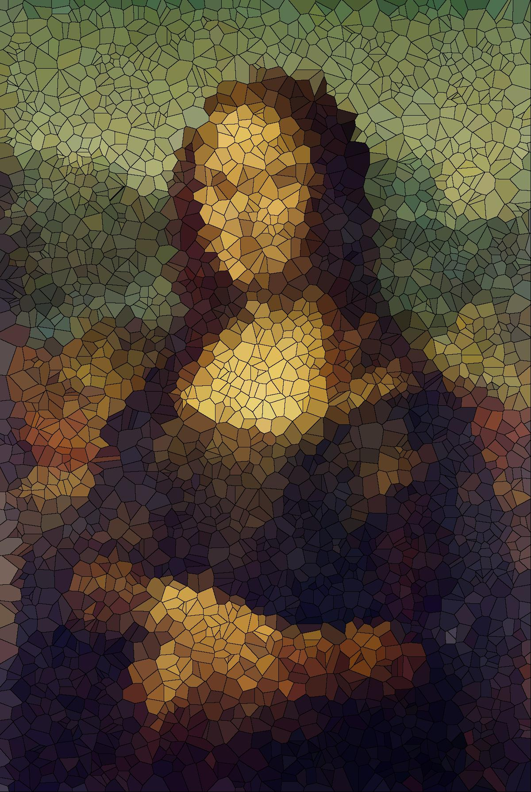
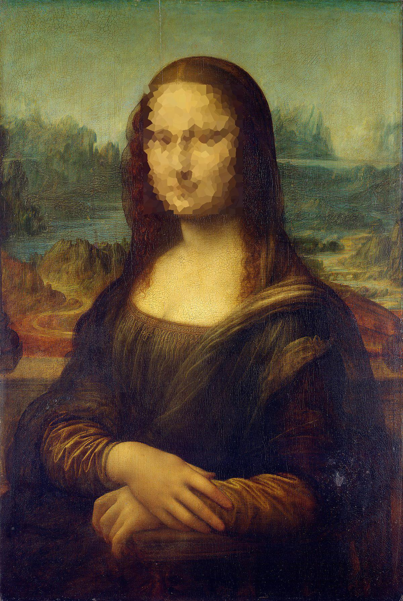

# Voronoi Image Processing

<p align = 'justify'>
A simple python package that allows users to create filtered images using Voronoi diagrams. Here is an example on how to use this package.
</p>


```python
#Load all necessary libraries
from IPython.display import Image as IPImage
from voronoi_image_processing import *

test_image = IPImage(filename = 'mona_lisa.jpeg')
display(test_image)
```

    Using TensorFlow backend.


```python
#image is either the name of the iamge or the location of the image.
image = 'mona_lisa.jpeg'

#num_cells = number of voronoi cells
#distance  = distance function used to find nearest cell location
#add_boundary = boolean that determines if a cell has a boundary 
#alternate_cell_color = boolean that determines if every cell is colored or black and white.
#display_new_image = boolean that determines if you want to display the new image after processing
params = {'num_cells': 3000, 'distance': 'euclidean', 'add_boundary': True, 'alternate_cell_color': False}
generate_filtered_image(image, **params)
```

    1) Assigning Points To A Cell : 100%|██████████| 2145600/2145600 [00:09<00:00, 217918.72it/s]
    2) Creating A New Filtered Image : 100%|██████████| 3000/3000 [00:02<00:00, 1045.47it/s]
    3) Drawing Boundaries (Part 1) : 100%|██████████| 2145599/2145599 [00:06<00:00, 337110.53it/s]
    3) Drawing Boundaries (Part 2) : 100%|██████████| 2145599/2145599 [00:06<00:00, 332579.03it/s]


    0) Prior to Step 1, Ran Nearest Neighbor Algorithm For 4.37 secs 


```python
test_image = IPImage(filename = 'mona_lisa_filtered.jpeg')
display(test_image)
```





```python
params = {'num_cells': 500, 'distance': 'euclidean', 'add_boundary': False, 'alternate_cell_color': False}
generate_filtered_faces(image, **params)
```

    1) Assigning Points To A Cell For Face 1: 100%|██████████| 113960/113960 [00:00<00:00, 234856.67it/s]
    2) Creating A New Filtered Image For Face 1: 100%|██████████| 500/500 [00:00<00:00, 3207.51it/s]


    0) Prior to Step 1, Ran Nearest Neighbor Algorithm For 0.23 secs on Face 1 


```python
test_image = IPImage(filename = 'mona_lisa_filtered.jpeg')
display(test_image)
```




